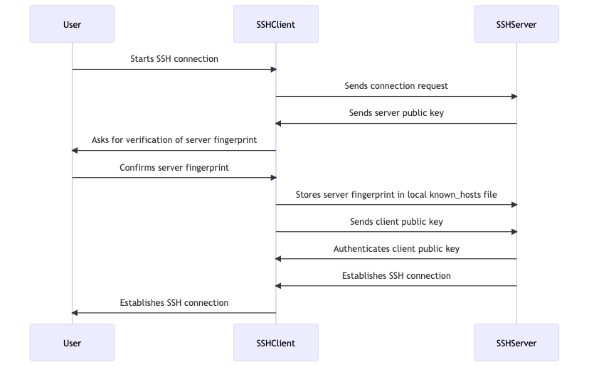

# SSH Client

**Why does the ssh client tutorial comes before any linux basic topic?**

SSH (Secure Shell) is a secure network protocol used for remote access and secure communication over unsecured networks. It allows users to securely access and control remote machines over the internet, as well as securely transfer files between them.

You will eventually start out on a Windows Client and for the rest of the exercise you will need a Linux VM. In [step 00](./../00-before_you_begin/README.md) you should have created a VM. In order now to logon to the VM, a ssh client application is necessary.

## SSH General Overview (Basic)


General terminilogy that should be known

| Term | Definition |
| --- | --- |
| Authentication layer | The layer responsible for conducting the SSH authentication. |
| Client | A client program for establishing a connection with the server. |
| Client machine | A computer running an SSH client. |
| Connection layer | The layer of the SSH protocol that manages communication channels. |
| Local computer | A computer running an SSH client at the location. |
| Local user | A user accessing SSH over the local computer. |
| Private key | Part of the public-private key pair for user authentication kept as a secret on the local machine. |
| Public key | Part of the public-private key pair for user authentication copied to the SSH server during the authentication process. |
| Remote computer | A computer running an SSH server to which SSH clients connect. |
| Remote user | A user accessing SSH over a remote computer. |
| Server | An SSH server program for communicating with SSH clients. |
| Server machine | A computer running an SSH server. |
| SCP | Secure Copy - a CLI utility that utilizes SSH for secure file transfer. |
| SFTP | Secure File Transport Protocol - a protocol using SSH to secure network file transfers, not to be confused with FTPS, which leverages TLS/SSL. |
| Transport layer | The layer of the SSH protocol overlooking the entire SSH session. |

Besides the normal `ssh` client applications there are other commands that are related and should be known. Not all the commands are covered here, since there are not really needed in depth for starting with ssh in general.

| SSH binary | Description |
| ------ | ----------- |
| ssh | The main SSH client binary, used to connect to remote SSH servers. |
| sshd | The main SSH server daemon, used to listen for incoming SSH connections and authenticate remote clients. |
| ssh-keygen | A utility for generating public and private key pairs for SSH authentication. |
| ssh-agent | A program that runs in the background and stores SSH keys in memory for easy use with SSH clients. |
| scp | A command-line utility for securely copying files between systems using SSH. |
| sftp | An interactive command-line utility for securely transferring files over SSH. |
| ssh-add | A utility for adding SSH keys to the ssh-agent. |
| ssh-keyscan | A utility for retrieving SSH server public keys for use with SSH clients. |

There are 3 Ways to logon to a Linux system with ssh. _The way to logon is configured on the SSH server._

- Logon via user password
- Logon via SSH key
- Logon via SSH key and user password

The following sections describe the _default_ way and therefor the connect with the usage of a SSH key.

## SSH Keys (Basic)

To generate a SSH key the command `ssh-keygen` is being used.

**A SSH key can be secured by setting a passphrase. This is also recommended. A passphrase secures the key from unauthorized access. Especially if the key stored on a non-private system or on a cloud drive, make sure that a passphrase is set. Depending on where the key is being used, the key also is attached to the permissions of that User context.**

During the creation of a key a passphrase and path for a location will be asked for.

Create at least one key from the examples:

```shell
ssh-keygen -t rsa -b 4096 # create a RSA SSH key with a strengh of 4096
ssh-keygen -t rsa -b 8192 # create a RSA SSH key with a strengh of 8192
ssh-keygen -t ed25519 # create a ED25519 SSH key (there is no strengt option required)
```

You will be asked for a path and keyname. You are able to create multiple keys for differnt use cases. You can directly specify the path and name with adding the `-f` parameter. With `-C` you can also specify an extra comment to make it easier for your to identify use cases.

For example:

```shell
ssh-keygen -t rsa -b 4096 -C "myworkkey@hostname" -f /path/to/your/custom/myworkkey
ssh-keygen -t ed25519 -C "myprivatekey@home" -f ~/.ssh/myprivatekey
```

**Beware! that if a key already exist and you overwrite it, the existing key will be deleted and depending if you have a backup, the key is gone and therefore the ability to use it.**

### Public and Private Keys (Basic)

When a SSH key is created, 2 files with the same name can be found in the path you specified. One key has a `.pub` extension which marks the key as a public key. A public key can be shared without any problems. The other file without any extension is the private key file. **This file needs to be protected at any time, which is _your responsibility_**.

The privat key is being used to decrypt and the public key is being used to encrypt data.

Take a look at both files of your SSH key with:

```shell
cat ~/.ssh/id_rsa # the private key file if you created a default key name with type RSA
cat ~/.ssh/id_rsa.pub # the public key file if you created a default key name with type RSA
cat ~/.ssh/id_ed25519 # the private key file if you created a default key name with type ED25519
cat ~/.ssh/id_ed25519.pub # the public key file if you created a default key name with type ED25519
```

### SSH Key Types (Adavanced)

There are different key types that can be generated. The most common type is `RSA` and still the _default_ type (as of time of writing this document).

The recommended SSH key type is to use `ed25519`. **Since this is the newest key type only use this if you are not dealing with legacy SSH servers.**

### ~/.ssh/authorized_keys File (Basic)

In order to login with a user using a SSH key to a SSH server an entry of the generated _public_ key in the `$HOME/.ssh/authorized_keys` files is required.

The `authorized_keys` file controlls which keys and therefor remote systems are allowed to login with this user identity.

## SSH Connect (Basic)

To connect to a SSH server (Linux VM) use one of the following examples:

```shell
ssh user@fqdn # uses the default key in your ~/.ssh/ directory to login
ssh -i </pathto/sshprivatekeyfile> user@fqdn # uses a specified ssh key through -i (identityfile) to login
```

## ~/.ssh/known_hosts File (Basic)

In the file `~/.ssh/known_hosts` file the SSH server host key fingerprint is stored.

Why do you need to know that. In case the fingerprint changes you will receive an error upon connect with the SSH client.

Example of a fingerprint mismatch error:

```shell
@@@@@@@@@@@@@@@@@@@@@@@@@@@@@@@@@@@@@@@@@@@@@@@@@@@@@@@@@@@
@ WARNING: REMOTE HOST IDENTIFICATION HAS CHANGED! @
@@@@@@@@@@@@@@@@@@@@@@@@@@@@@@@@@@@@@@@@@@@@@@@@@@@@@@@@@@@
IT IS POSSIBLE THAT SOMEONE IS DOING SOMETHING NASTY!
Someone could be eavesdropping on you right now (man-in-the-middle attack)!
It is also possible that a host key has just been changed.
The fingerprint for the RSA key sent by the remote host is
0a:1b:2c:3d:4e:5f:6g:7h:8i:9j:10k:11l:12m:13n:14o:15p.
Please contact your system administrator.
Add correct host key in /home/user/.ssh/known_hosts to get rid of this message.
Offending RSA key in /home/user/.ssh/known_hosts:23
RSA host key for example.com has changed and you have requested strict checking.
Host key verification failed.
```

This following diagram shows the sequence of a SSH connect:



## SSH Agent (Advanced)

The `ssh-agent` command is used to manage SSH private keys. When an SSH client attempts to establish a connection to a remote server that requires authentication, it will ask the ssh-agent for the necessary private key.

Benifits:

- Avoids the need to repeatedly enter passphrase
- Enhances security through in memory encryption
- Simplifies key management

The `ssh-agent` can be started with

```shell
ssh-agent # you will get the environment of the agent printed on the CLI stdout
eval $(ssh-agent) # environment of the ssh-agent will be set directly
```

What is difference? With the first example you need to paste the environment variables directly in your shell or add it to your `~/.bashrc` file. This means as long as the running process exists (until after a system reboot eg.) every shell that you create will use the environment variables from this `ssh-agent`. After a reboot a new `ssh-agent` has to be started and the variables have to be replaced in the `~/.bashrc` file.

The second command will start the `ssh-agent` in the background. If you create a new shell or login a second time with ssh, the environment will not be accessible from the new shell.

To use the `ssh-agent` you will have to use `ssh-add` to add your _private_ SSH keys. If the keys have a passphrase set, the passphrase has to be entered after executing it.

Examples:

```shell
ssh-add ~/.ssh/id_rsa
ssh-add /pathto/privatekeyfile
ssh-add -l # will show all keys that are loaded into the agent
```

## SSH Tunnels (Adavanced)

SSH tunneling, also known as SSH port forwarding, is used to route network traffic between two computers through a SSH connection. It can be used to securely access remote resources, such as a database server, web server or other network services, that would otherwise be inaccessible due to firewall restrictions or other security policies

General Example Workflow for a local port forward


There 2 distinct usage scenarios:

1. Local Port Forwarding

    To forward traffic from a local port on your computer to a remote server, use the following

    ```shell
    ssh -L <local port>:<destination address>:<destination port> <remote server>
    ssh -L 8080:localhost:80 user@remote-web-server.com # for example to access the remote webserver that is running on port 80 on local port 8080
    ```

2. Remote Port Forwarding

    ```shell
    ssh -R <remote port>:<destination address>:<destination port> <local computer>
    ssh -R 8080:localhost:80 user@local-computer.com # for example forward traffic from remote port 8080 on a server to port 80 on your local computer
    ```

## Putty vs. OpenSSH (Advanced)

On Windows there is actually a ssh client application installed and you can use `powershell` in order to login to remote Linux VMs.

If a ssh client is not available to you, there is an application called `Putty` which was for long time the standard when it came to connect to Linux VMs (SSH Servers).

If `Putty` is not installed on your system, it can be downloaded from the [orignal website](https://www.chiark.greenend.org.uk/~sgtatham/putty/). **Do not download this from any other site**.

Besides the normal ssh client, there is also a `ssh-keygen` GUI, called `puttygen.exe` and `ssh-agent` called `pagent.exe` that can be downloaded. 

**IMPORTANT NOTE: Putty uses a different ssh key format which is not compatible with the normal OpenSSH format**

Example to convert a key from putty to OpenSSH format

```shell
puttygen mykey.ppk -O private-openssh -o mykey.pem
```

Example to convert a key from OpenSSH to putty format

```shell
puttygen mykey.pem -o mykey.ppk
```
