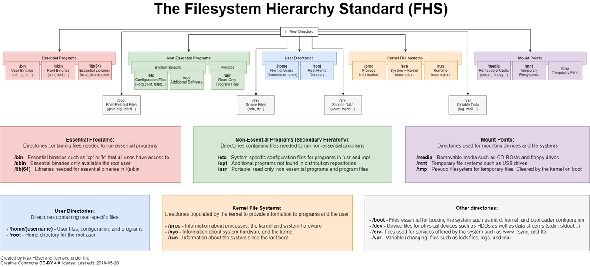

# First Steps

- [First Steps](#first-steps)
  - [A little bit of theory first! Filesystem Structure explained](#a-little-bit-of-theory-first-filesystem-structure-explained)
    - [Pseudo Filesystems](#pseudo-filesystems)
    - [Filesystem Types](#filesystem-types)
  - [Working with Files](#working-with-files)
    - [ls (list files and directories) (Basic)](#ls-list-files-and-directories-basic)
    - [cd (change directory) (Basic)](#cd-change-directory-basic)
    - [mkdir (create directories) (Basic)](#mkdir-create-directories-basic)
    - [touch (create empty files / but not only that)](#touch-create-empty-files--but-not-only-that)
    - [cp (copy files) (Basic)](#cp-copy-files-basic)
    - [mv (move files) (Basic)](#mv-move-files-basic)
    - [rm (remove files and directories) (Basic)](#rm-remove-files-and-directories-basic)
  - [Mounts and Filesystem Free Space (Basic)](#mounts-and-filesystem-free-space-basic)
    - [mount (show mounted filesystems)](#mount-show-mounted-filesystems)
    - [df (show freespace of filesystems)](#df-show-freespace-of-filesystems)


##  A little bit of theory first! Filesystem Structure explained

The Linux filesystem structure has a hierarchical format. A basic structure and explaination is shown below.



[Source](https://www.sobyte.net/post/2022-08/linux-tree-structured-file-system/)

**Why is that even important? Because everthing is somehow related to a filesystem path when you are doing something. When you are using a binary, editing a configuration file, searching for logs and so on.**

- /: This is the root directory of the Linux file system. All other directories and files are located under the root directory.
- /bin: This directory contains essential system binaries (commands) that are required by all users. For example, the cat, ls, and mkdir commands are located in the /bin directory.
- /sbin: This directory contains system binaries that are required by the system administrator. For example, the shutdown, reboot, and iptables commands are located in the /sbin directory.
- /usr: This directory contains user-related programs, libraries, and documentation. The /usr directory is typically read-only, and it is often shared between multiple systems.
- /usr/local: This directory is used for locally installed software and is often used to distinguish software installed by the system administrator from software installed by the distribution package manager. The /usr/local directory contains its own subdirectories, such as /usr/local/bin, /usr/local/sbin, and /usr/local/lib, which are used for storing locally installed binaries, system binaries, and libraries, respectively.
- /etc: This directory contains system configuration files. For example, the /etc/passwd file contains information about user accounts, and the /etc/fstab file contains information about file systems that are mounted at boot time.
- /var: This directory contains variable data files, such as log files and spool files. For example, the /var/log/messages file contains system log messages.
- /home: This directory contains user home directories. Each user has their own subdirectory under the /home directory, which is typically used to store user-specific files and settings.
- /opt: This directory is used for installing third-party software and is often used for installing large software packages that do not conform to the standard file system hierarchy. The /opt directory contains its own subdirectories, which are used for organizing the installed software according to the vendor's naming convention or application name.

> **the description should be standard, but can vary from Linux distribution to distribution.**

### Pseudo Filesystems

Pseudo filesystems provide a way for the kernel and user-space programs to interact with system resources. 

The following filesystems only exist in the memory and are being created during the boot process:
- /proc: provides an interface to the kernel's internal data structures and processes. It allows users and programs to access information about system processes, system memory usage, hardware configuration, and other system statistics.
- /sys: provides a virtual representation of the system hardware and devices. It allows users and programs to access and modify device configuration and status information, such as device drivers, interrupts, and power management settings.
- /dev: provides an interface to the system's devices. It allows users and programs to access and control physical and virtual devices, such as hard drives, serial ports, and network interfaces.

The following filesystem also store their files in the _normal_ filesystem:
- /run: This filesystem provides a location for runtime data that needs to be stored between reboots. It is used by various system components and applications to store information such as process IDs, socket files, and lock files.
- /tmp: This filesystem provides a temporary storage space for files that do not need to persist between system reboots. It is used by various system components and applications to store temporary data and files.

### Filesystem Types

Like every other Operating System, Linux needs a [filesystem](https://www.wikiwand.com/en/File_system) on top of virtualized or hardware devices in order to organize directories and files.

On a Linux system a variety of filesystem implementations (local/network) can be used and depending on the number of devices can also be of different kind on any of these devices.

There are some popular filesystems:
- [ext4](https://www.wikiwand.com/en/Ext4)
- [xfs](https://www.wikiwand.com/en/XFS)
- [btrfs also called butterFS](https://www.wikiwand.com/en/Btrfs)

When it comes to network devices popular implementations are:
- [NFS](https://www.wikiwand.com/en/Network_File_System_(protocol))
- [SMB for mounting Windows Shares for example](https://www.wikiwand.com/en/Server_Message_Block)

## Working with Files

You should now have a better picture on how Linux filesystems are structured and where what can be found.

First use the the following two command `ls` and `cd` to navigate through the filesystem hierarchy.

### ls (list files and directories) (Basic)

With `ls` you can list the content of directories. There are some flags that commonly widely used

```shell
ls # list files and directories without any information
ls -la # -l display content in long format / -a display all files including dotfiles
ls -altr # -t sort by time newest first / -r reverse the sort order .. newest at the bottom now
ls -latrR # -R recursive all subfolders
ls -laSr # -S sort by size / -r reverse sort to see the biggest at the bottom
```

### cd (change directory) (Basic)

With `cd` you can navigate through the filesystem. Try the following commands when you are looking at the single directories and subdirectories in general.

```shell
cd # go to your $HOME directory
cd ~/ # same ... while ~/ will always act as prefix in a path for your home directory
cd /var # go to a specific folder
cd log # change directory in the same hierarchy levcel
cd - # return to your previous path
cd .. # go in the filesytem one level up
cd ../../ # go two levels up in the filesystem
```
Look at the folders as described in the [A little bit of theory first! Filesystem Structure explained](#a-little-bit-of-theory-first-filesystem-structure-explained) section to get a feeling of how to navigate and use the commands. 

### mkdir (create directories) (Basic)

Now, lets create some directories in order to work with files. `mkdir` has several useful options

```shell
mkdir dir1 # will always create only one directory
mkdir -p dir1/dir2/dir3 # -p will let you create multiple folders and also will print no errors if a directory already exists
mkdir -m 0700 dir1/dir2/dir3/dir4 # will create a directory with other than default permissions
```
For more information about Permissions see [Users/Groups and Permissions](./users_and_groups.md)

### touch (create empty files / but not only that)

Like most of the times in Linux, there is not only one way to achieve something. `touch` is a command that can be used to create empty files, but the original use is to update the access and modifcation times of files.

Create an empty file with:
```shell
cd # change to your home directory
mkdir mydir # create a directory called mydir
cd mydir # change to your new directory
touch myfile # create an empty file called myfile
```

You can also see what `touch` also is capable of, with using `touch --help` and for example:
```shell
ls -la ~/.bashrc # display the information of your bash rc file
# look at the timestamp
touch ~/.bashrc # should update the modification time
ls -la ~/.bashrc # display the information of your bash rc file and compare from the ls command before
```

### cp (copy files) (Basic)

Now that we created `myfile` we are able to use other file commands, like `cp` to copy it.
```shell
cp myfile myfile2 # copies the file and with that creates a new file called myfile2
```

To copy directories `cp -r <source directory> <destination path or directory>` needs to be called. For example:
```shell
cp -r ~/mydir ~/mydir/mydir2 # copies the directoy inside of your current directory mydir
```
Some other important `cp` flags. For example:
```shell
cp -a # -a preserve the permissions of the source file(s)
echo "test" >> myfile2 # add the string test to your myfile2
cp -u myfile myfile2 # -u copy only if source is newer / this should not overwrite your myfile2
cp -i myfile myfile2 # ask before overwriting an existing file 
```

### mv (move files) (Basic)

In order to move with `mv` files or directories you need to be aware that moving also includes overwriting existing files.

For example:
```shell
mv myfile myfile3 # move myfile to myfile3
mv ~/mydir/mydir2 ~/mydir3 # move the folder mydir2 to the home directory mydir3
mv -i # also asks first before overwriting existing folders or files
```

### rm (remove files and directories) (Basic)

In order to delete files or directories the `rm` command is being used.

> **BEWARE! There is no trashbin when using rm on the linux shell. files are delete instantly and cannot be recovered (easily, or without a backup)**

To remove files or folders use the following examples:
```shell
rm myfile2 # delete the file myfile2
rm -r ~/mydir3 # -r removing a directory always requires the recursive flag
```
> **BEWARE! Do not use `rm -rf /` or always make sure what you are about to delete.** 

Adding an `alias rm='rm -i'` to your shell rc file is the recommended way to prevent accidential deletion of important files. Use the `flag -f` only when you have to.

## Mounts and Filesystem Free Space (Basic)

At the beginning the filesystem structure was explained a little bit. In Linux, _mounting_ is the process of making a file system available to the operating system, allowing users to access the files stored within it. When a file system is mounted, it becomes attached to a specific directory in the file system hierarchy, known as the _mount point_. 

### mount (show mounted filesystems)

To list the _mount points_ in the system the `mount` command can be used. The command displays also the mount options and types of the single mount points.

For example:
```shell
mount # just show all mounts
mount -t tmpfs # show all mounts with the filesystem type tmpfs
```
Most mount points are being managed in the file `/etc/fstab`. There are exceptions like _Pseudo-Filesystems_ or mount points created by other services (e.g. Docker).

Take a look at the `/etc/fstab` of your system to get the picture.
```shell
cat /etc/fstab # will output the complete file on the cli
```

### df (show freespace of filesystems)

The `df` command will show the usage statistics of the mounted filesystems in the system.

For example:
```shell
df # show usage statistics of all filesystems
df / # show usage statistics of the / root filesystem
df -h / # show usage statistics in human readable format for the / root filesystem
```
